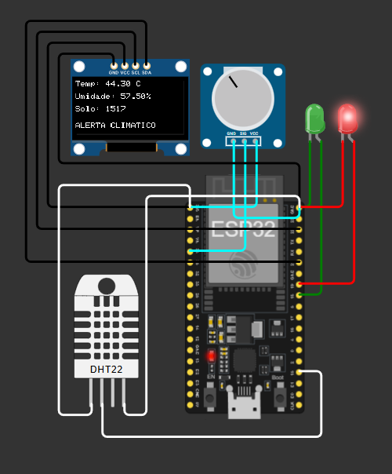
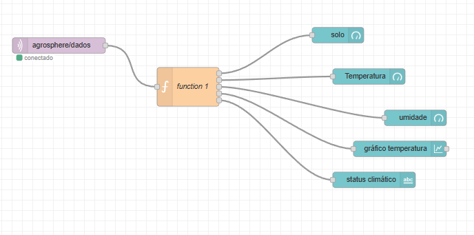
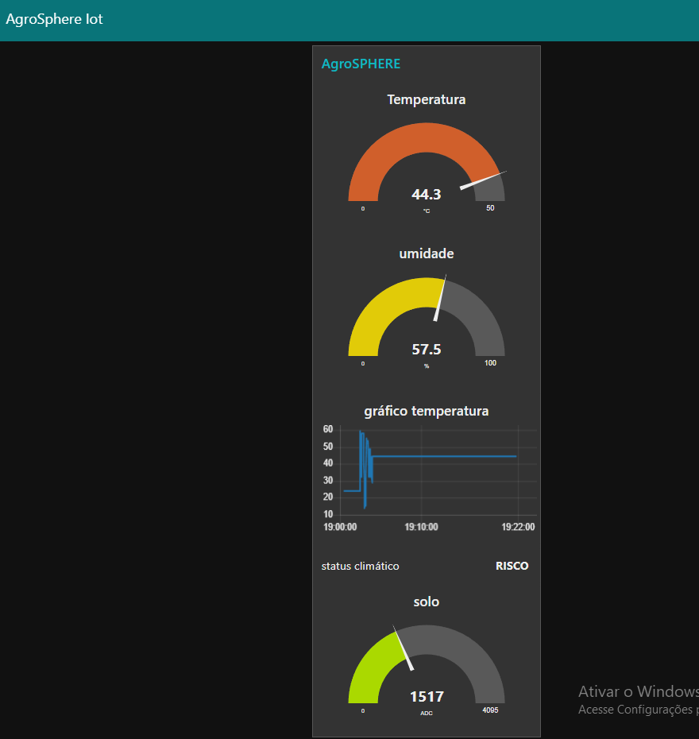

# 🌱 AgroSphere IoT

Sistema IoT inteligente para monitoramento climático agrícola utilizando ESP32, MQTT e Node-RED.

---

# 📌 Objetivo

O projeto AgroSphere foi desenvolvido para monitorar condições climáticas agrícolas em tempo real, auxiliando produtores rurais na tomada de decisão e prevenção de riscos ambientais.

---

# 🚀 Tecnologias Utilizadas

- ESP32
- MQTT
- Node-RED
- Wokwi
- OLED SSD1306
- Sensor DHT22
- Dashboard Web
- Wi-Fi
- JSON

---

# 📡 Funcionalidades

✅ Monitoramento de temperatura  
✅ Monitoramento de umidade  
✅ Monitoramento do solo  
✅ Dashboard em tempo real  
✅ Comunicação MQTT  
✅ Interface OLED  
✅ LEDs de alerta climático  
✅ Publicação JSON via Wi-Fi  
✅ Gráfico em tempo real  
✅ Automação climática inteligente  

---

# 🧠 Arquitetura do Projeto

```text
ESP32 → MQTT → Node-RED → Dashboard
```

---

# 🔌 Tópico MQTT

```mqtt
agrosphere/dados
```

---

# 📄 Exemplo JSON

```json
{
  "temperatura": 44.3,
  "umidade": 57.5,
  "solo": 1517,
  "status": "RISCO"
}
```

---

# 📷 Imagens do Projeto

## 🔧 Circuito ESP32

A simulação foi desenvolvida no Wokwi utilizando:

- ESP32
- Sensor DHT22
- Display OLED SSD1306
- Potenciômetro
- LEDs de alerta climático

### Imagem

```markdown

```


---

# 🌐 Fluxo MQTT + Node-RED

O fluxo do Node-RED realiza:

- Recebimento MQTT
- Conversão JSON
- Processamento de dados
- Atualização do dashboard em tempo real

### Imagem

```markdown

```


---

# 📊 Dashboard Web

O dashboard exibe:

- Temperatura
- Umidade
- Umidade do solo
- Status climático
- Gráfico em tempo real

### Imagem

```markdown

```


---

# ⚙️ Como Executar

## ESP32

1. Abrir o projeto no Wokwi
2. Instalar as bibliotecas:
   - PubSubClient
   - Adafruit SSD1306
   - Adafruit GFX
   - DHT sensor library for ESPx
3. Executar a simulação

---

## Node-RED

1. Importar o arquivo `flow.json`
2. Executar o Node-RED
3. Abrir no navegador:

```bash
http://localhost:1880/ui
```

---

# 📂 Estrutura do Projeto

```text
AgroSphere-IoT
│
├── codigo-esp32
│   ├── sketch.ino
│   ├── diagram.json
│   └── libraries.txt
│
├── node-red
│   └── flow.json
│
├── imagens
│   ├── circuito-esp32.png
│   ├── fluxo-node-red.png
│   └── dashboard-node-red.png
│
└── README.md
```

---

# 🌐 Comunicação IoT

O sistema utiliza comunicação MQTT via Wi-Fi para envio contínuo de dados em formato JSON entre o ESP32 e o dashboard Node-RED.

---

# 🚨 Regras de Automação

## ✅ Ambiente Estável

- Temperatura abaixo de 35°C
- LED verde ativo

---

## ⚠️ Ambiente de Risco

- Temperatura acima de 35°C
- LED vermelho ativo
- Alerta climático exibido no OLED e dashboard

---

# 👨‍💻 Integrante

- Felipe Ribeiro Salles de Camargo RM: 565224
- João Victor Santana os Santos RM: 566063
